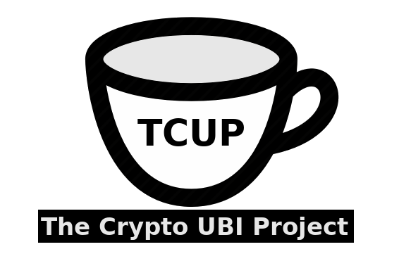

# The Kuwa ID Platform and The Crypto UBI Project (TCUP)

This repository contains the Kuwa Identity Platform and The Crypto Universal Basic Income Project (TCUP, which we pronounce "teacup"). [The Kuwa Foundation](http://kuwa.org) the University of Massachusetts Amherst Center for Data Science (CDS) initially developed this software as part of the CDS's Data Science for the Common Good program.

**IMPORTANT: This software comes with no warranties and is highly experimental. You should not use it in any non-experimental application, and especially not use it in an application that could risk something of value. USE THIS SOFTWARE AT YOUR OWN RISK.**

We are developing a cryptocurrency "faucet" to deliver a universal basic income (UBI). As part of the project, we will implement the Kuwa identity system.
A high-level description of the project can be found [here](http://www.kuwa.org/Kuwa-Driven_Basic_Income_Faucet.pdf).

## Version

* 0.5.0

## Release History

* 0.5.0
    * PRE-ALPHA: Working prototype

## Getting Started

The purpose of these instructions is to help you get the modules in this project running.

## Prerequisites

The following software packages are prerequisites for running the software in this repository.

  * A Linux computer
  * [NodeJS](https://nodejs.org/en/) 10.4.1 or higher
  * Gradle 4.8.1 or higher
  * MySQL (for some modules)
  * Apache Web Server 
  * [Apache Cordova](https://cordova.apache.org/) (For deploying JavaScript applications as Android and iOS apps)
  *  OpenCV - Face recognition toolkit

## Also Built With

* [React](https://reactjs.org/) - Component-based JavaScript environment for building advanced Web user interfaces
* [Web3.js](https://github.com/ethereum/web3.js/) - Ethereum JavaScript API
* [Solidity](solidity.readthedocs.io/) - Development language for Ethereum smart contracts

## Installing Project Modules

Please see the readme files in each module directory for instructions on running specific modules. 

## Licensing
All of the original code developed and published by The Kuwa Foundation is open source under the standard MIT License. Please note, however, that other types of open source licenses may govern some of the utilities, libraries and/or plugins that we use to build Kuwa and TCUP. In particular, the Apache license applies to the Cordova software that we use to deploy client software as mobile apps. 

## Contributing

Please read [CONTRIBUTING.md](https://gist.github.com/hrishikash/d3d1be3d33025638f891a072753526b7) for details on our code of conduct, and the process for submitting pull requests to us.

## Versioning

We plan to use [SemVer](http://semver.org/) for versioning. For the versions available, see the [tags on this repository](https://github.com/your/project/tags). 

## Development team

* **[Carlos Daniel Mondragon Chapa](https://www.linkedin.com/in/carlosmondragonchapa/)** - Software Engineer
* **[Deh-Jun Tzou](https://www.linkedin.com/in/deh-jun-tzou/)** - Software Engineer
* **[Hrishikesh Kashyap](https://www.linkedin.com/in/hrishikeshkashyap/)** - Software Engineer
* **[Jim Flynn](https://jamespflynn.com)** - Project leader, [Kuwa white paper](https://jamespflynn.com/2018/03/01/kuwa-a-decentralized-pseudo-anonymous-and-sybil-resistant-individual-identification-system/) author and President of The Kuwa Foundation 
* **[Manush Gupta](https://www.linkedin.com/in/manush-gupta-28657656/)** - Software Engineer
* **[Priyadarshi Rath](https://www.linkedin.com/in/priyadarshirath/)** - Software Engineer

## Contributors and supporters

* **[Bill Clarke](https://www.linkedin.com/in/bill-clarke-0850b850/)** - Technical advisor
* **[Brant Cheikes](https://www.cics.umass.edu/people/cheikes-brant)** - Executive Director, UMass Center for Data Science
* **[Gavin Andresen](https://www.linkedin.com/in/gavin-andresen-6987971/)** - Assisted by giving many hours of feedback, technical review and advice. Helped formulate the "UBI faucet" concept.
* **[Philip Silva](https://www.linkedin.com/in/philip-silva-0124a4b/)** - Kuwa Foundation director and co-founder. Contributed project funding.
* **[Stuart Tempkin](https://www.linkedin.com/in/stuart-tempkin-789a7259/)** - Kuwa Foundation director and co-founder. Contributed project funding.
* 
<!--See also the list of [contributors](https://github.com/your/project/contributors) who participated in this project.-->

## License

We distribute all of the original software we developed for this project under the standard MIT License. Please note, however, that some of the packages that we used to build this project may be licensed under different open source licenses. For example, the Cordova software is covered by the Apache License.

